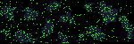
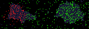
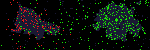
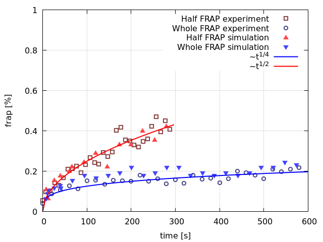
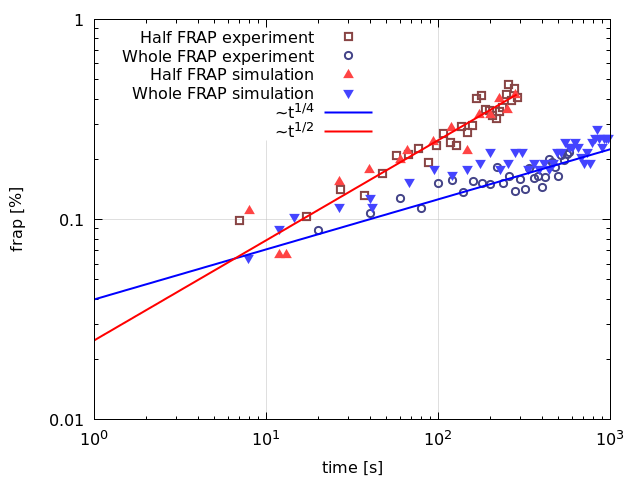

# AggresomeIPBM

Modelling of aggresome formation using a Flory-Huggins (FH) continuum model and an Individual-Protein Based Model (IPBM). The IPBM is used to  simulate the collective dynamics of the proteins during liquid-liquid phase separation and during FRAP experiments ([Li et al, Science Adv. 7, 43 (2021)](https://www.science.org/doi/10.1126/sciadv.abh2929)). The FH model is used to explain droplet compaction and RNA partitioning (REFERENCE). 

<sub>The software is freely distributed under the GNU General Public License Version 3 (2007); see [LICENSE.txt](LICENSE.txt).</sub>

 &nbsp; &nbsp;  &nbsp; &nbsp; 

  

## Cite software

The kMC algorithm and postprocessing tools were developed in [Schaefer, Phys Rev Lett 120, 036001 (2018)](https://journals.aps.org/prl/abstract/10.1103/PhysRevLett.120.036001) and in [Schaefer et al., Soft Matter, 15, 8450-8458 (2019)](https://pubs.rsc.org/en/content/articlelanding/2019/sm/c9sm01344j). The methods were applied in a biological physics context (LLPS) in [Li et al, Science Adv. 7, 43 (2021)](https://www.science.org/doi/10.1126/sciadv.abh2929).

## Features


* Modelling of a cell  
  * Rectangular 2D or cuboid 3D lattice  
  * Non-permeable cell wall  
  * Excluded volume (e.g., due to organelles or due to model cell porosity)  
  * Regions of attraction (microtubuli, stress granules, aggresomes) that can attract proteins.  
  * Energetically disordered landscape (Gaussian Disorder Model + Exponential traps) - only implemented for single protein  
* Protein dynamics  
  * One or two types of proteins ('A' and 'B').  
  * Protein diffusion by nearest-neighbour hopping.  
  * Protein-environment interaction (regions of attraction and/or Gaussian Disorder Model)  
  * Excluded volume interaction of A-A and B-B pairs (not yet for A-B pairs).  
  * A-A and B-B nearest-neighour interaction; A-B same-site interaction (application: A may liquid-liquid phase separation, to form regions of attraction for B binding).  
* Photobleaching (FLIP/FRAP) simulations  
* Protein tracking (determine diffusivities)
* Continuum theory


## Installation / Usage


**Main simulation program**  
(for a more detailed description, go to the [online manual](doc/manual.md))  
```mkdir build```  
```cp src/compile.sh build```  
```cd build```  
```./compile.sh```

**Postprocessing (scripts in utils)**  
* bash / shell script (.sh files); typically also uses *awk* to read files and do simple calculations.  
* matlab / [octave](https://www.gnu.org/software/octave/) scripts (.m files).   Install:  
```sudo apt-get install octave```  
Installing packages (e.g., struct, optim, statistics), can be installed from the octave command line:  
```pkg install -forge struct optim statistics```
* python scripts (.py files).  
* [gnuplot](http://www.gnuplot.info/) scripts (.plt files); install:  
```sudo apt-get install gnuplot```  

**Usage**  
See [online manual](doc/manual.md) for more info.
Summarised, compilation, running the software and postprocessing are exemplified in the script doc/demo2D.sh.
To run it:  
```cp doc/demo2D.sh build```  
```cd build```  
```./demo2D.sh```  


## Utilities 

* Create Cell Topology  
  * createCellTopology.m: Create simulation volume with regions of attraction (aggresome/stress granule) and excluded volume (nucleoid and/or cell porosity).  
* Photobleaching  
  * Create bleaching profile *createBleachingProfile2D.m*  
  * Analyse FRAP recovery  
* Structure Factor and Correlation Function  
  * StructureFactorAndCorrelationFunction.o reads cnf files and analyses them.  
  * plotCR.sh and plotSF.sh read the output by StructureFactorAndCorrelationFunction.o, and plot it using gnuplot.
* Visualise Configuration  
  * 2D: cnf2png.m (matlab/octave): read cnf/cnf.dat file and create img/cnf.png  
  * 3D: visualisation3D.py: Reads file generated by simulations when particle tracking is activated. The python script will open a GUI where you can choose the simulation file and how to visualise the simulation. DOES NOT work with the newest matplotlib version. Use matplotlib version 3.0.3  
* Flory Huggins Continuum Model (utils/ContinuumTheory)
  * Thermodynamics: Droplet compaction and RNA partitioning  
  * Dynamics: RNA partitioning  
  


## Development

* Bugs:
  * usage of assert() to verify the existence of files  
  * Testing on windows 10, document installation difficulties  
* High priority  
  * Import/export 3D data  
* Other Features  
  * Continue previous simulation (currently only 2D and without photobleaching).  
  * Two components: excluded volume + NN interaction; compatibility with regions of attraction  
  * Continuous bleaching profile  
  * flexible multi-component  
* Other Utilities   
  * cluster-size distribution  
  * Analysis: structure factor3D  
  * visualisation  
  * get diffusivities from particle tracking output  
  * Simulate FLIP/FRAP:  get FLIP/FRAP from particle tracking output; focus radius, bleach profile  
  * Simulate optics: point-spread function (convolution), *z*-dependence.
* Manual  
  * expand explanation    
  * add demos with disordered energy landscape  
* Compilation  
  * Robust make script needed to compile software.  
  * Modularity of src scripts.

## Acknowledgements/contributions
The software was developed by Charley Schaefer with help of Johannes Wesseler. The development benefited from discussions with Tonek Jansen, Ji-Eun Li, Xi Jin, Stefan Paquay, Tom McLeish, Mark Leake, Bai Fan. 
Random numbers are generated using the *SFMT* pseudorandom number generator, developed by Mutsuo Saito and Makoto Matsumoto, [link](http://www.math.sci.hiroshima-u.ac.jp/~m-mat/MT/SFMT/).
The Gaussian disorder model uses ErfInv, developed by Lakshay Garg, [link](https://github.com/lakshayg/erfinv).
The development of the software took place at the University of York, UK, and was funded by the EPSRC under grant number EP/N031431/1. 
