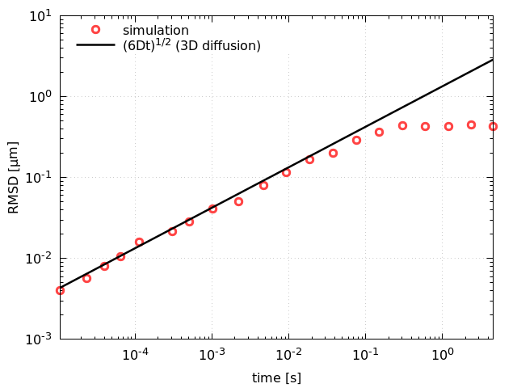
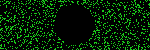
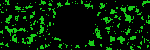
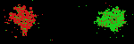
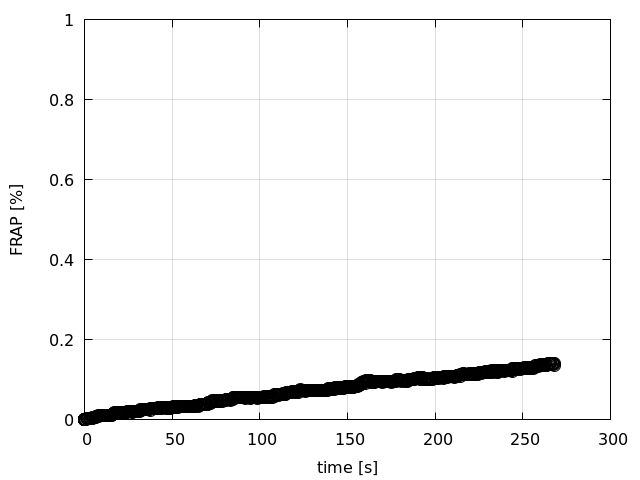
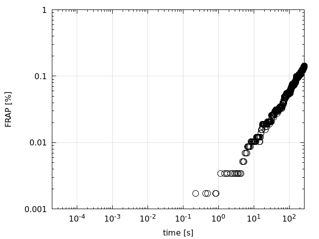
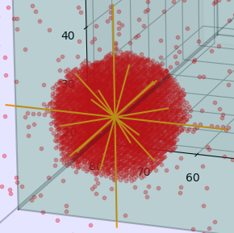

# Manual

## Contents

1. Introduction  
2. Getting Started  
  2.1. Installation  
  2.2. General approach / Workflow  
  2.3. Example: Regular diffusion of self-excluding proteins in 3D  
  2.4. Example: Spontaneous single-protein LLPS in 2D  
  2.5. Example: Single-protein FRAP with excluded volume in 2D  
  2.6. Example: Two proteins - FRAP & LLPS in 2D  
  2.7. Example: Microtubule-induced Protein Aggregation  
3. Features  
  3.1. Simulation time  
  3.2. Defining a cell topology  
      &nbsp;&nbsp;&nbsp;&nbsp;a. Simulation volume  
      &nbsp;&nbsp;&nbsp;&nbsp;b. (Optional) Excluded volume and regions of attraction  
      &nbsp;&nbsp;&nbsp;&nbsp;c. (Optional) Cell porosity: Density of states  
  3.3. Defining the properties of a protein  
  3.4. Particle tracking  
  3.5. Photobleaching  
  3.6. Simulation output & Postprocessing  
4. Simulation Algorithm

  
## 1. Introduction  

Section 2 describes the installation of the software, the general workflow of using it, and discusses a number of examples/demos.
The complete overview of features is given in Section 3, and the simulation algorithm is briefly discussed in Section 4.


## 2. Getting Started

###  2.1. Installation

The program is developed on Linux and should be compatible with Mac and Windows.
The unix shell commands to install and run the program can be emulated on windows using PuTTY or bash for windows (available for windows 10 (64 bits)).
Assuming this all works, you can get the software by downloading it from [here](https://github.com/CharleySchaefer/AggresomeIBM), or by using the command line by running  
```git clone https://github.com/CharleySchaefer/AggresomeIBM```  
After downloading, enter the AggresomeIBM folder (```cd AggresomeIBM```) and create a build directory  
```mkdir -p build```  
copy the compilation script from the source directory *src* to *build*:  
```cp src/compile.sh build```  
and enter *build* via  
```cd build```  
The program is compiled by running the shell script  
```./compile.sh```  
This should create the executable ```IMB```, as well as some postprocessing tools in the utils directory.
The installation does not write/copy anywhere else but in the AggresomeIBM; hence, to uninstall one can simply delete the AggresomeIBM folder.

The executable ```IBM``` does not have a graphical user interface and should be run from the command line or using (plain text) shell scripts (.sh).
The possible input is shown by running ```./IBM --help```. 
**When using anti-virus software**, confirm that the executable is not being blocked while running it. 
Examples of input are given by the demo scripts, discussed below.
These scripts not only run the software, but also do some postprocessing, for which additional software may be needed (matlab/octave/python/gnuplot):
For most of the postprocessing .m scripts are used, which are run using (open-source) [octave](https://www.gnu.org/software/octave/), which maybe installed through
```sudo apt-get install octave```  
Alternatively, the .m scripts can be run by matlab; this may require to adapt a couple of scripts.
Installing packages (e.g., struct, optim, statistics), can be installed from the octave command line:  
```pkg install -forge struct optim statistics```  
For plotting, we typically use (.plt) scripts run by [gnuplot](http://www.gnuplot.info/), which can be installed through  
```sudo apt-get install gnuplot```  


###  2.2. General Approach / Workflow

Simulations are performed in three steps: first the simulation is prepared (preprocessing), then the simulation is run (processing), and then the results are analysed (postprocessing).

During **preprocessing**, we set the volume of the simulation, the cell topology (optional), the number of proteins and their properties, and, in case photobleaching is simulated, the time at which the cell is bleached and the bleaching profile. 
Apart from the physics, we also set the number of time steps, and define information of how often to export data during the simulation and what and where to output it.
In practice, we may wish to average results over multiple simulations with different 'random number seeds' to obtain better statistics, or to systematically 'sweep' a simulation setting (e.g., the position of the laser focus for photobleaching).
At this moment, the software does not have a graphical user interface and these variations are done using shell scripts, as exemplified in the demo_xxx.sh scripts.

After preprocessing, the simulation is run (**processing**). The progress is printed on the screen (number of iterations/percentage), and simulation 
data is exported to 'timeprogress.out', 'settings.out', 'cnf', and, depending on the options used, a number of other files as well.

The raw simulation data is analysed during **postprocessing**.
This includes converting the cnf files to png images, analysing the cnf files, e.g., calculating the structure factor and the correlation function, calculating FRAP transients, and averaging the results over multiple simulations. An example of averaging over multiple simulations is given in [this](demo2D_2CFRAP/demo2D_2CFRAP.sh) demo script.

In the demo scripts, examples of this workflow are provided. These are discussed below.

###  2.3. Example: Regular diffusion of self-excluding proteins in 3D  

See [demo](demo3D_freediffusion). The software can be benchmarked against theoretical predictions.
The simplest example is the time dependence of the mean square displacement (MSD) of proteins under dilute conditions.
The theoretical prediction is MSD=2*Dt* in 1D, MSD=4*Dt* in 2D  MSD=6*Dt* in 3D, with *D* the diffusivity.
The demo *demo3D_freediffusion.sh* benchmarks the software against the 3D prediction.
Note that the time and positions in the simulation output is given in monte carlo units.
The demo script shows how the conversions to physical units are performed.



 **Figure**: Root mean square displacement (RMSD) of dilute proteins in a simulation volume. For sufficiently short times the RMSD is described by RMSD=(6*Dt*)<sup>1/2</sup>, with *D* the diffusivity, while at late times the RMSD approaches a plateau comparable to the size of the simulation volume (600 nm in this simulation).
 
 To set up the simulation, one has to cerate a simulation volume that is sufficiently large (note that the walls impose a confinement) and in which the proteins are sufficiently dilute so they do not affect each others mobilities.
  For instance, a 30x30x30 box can be created with lattice spacing *dx*=20 nm, and 50 proteins (concentration <<0.2%) with hop rate *nu=1* in Monte Carlo units,  
```./IBM --Nx 30 --Ny 30 --Nz 30 --NA 50 --epsAA 0.0 --Niter 100000 --Niter-print 10 --particle-tracking```,  
  here the argument ```--NA``` sets the number of 'A' protein. The nearest-neighbour interactions between A proteins is set by ```--epsAA```, with the value given in units of thermal energy *kT*, with *k* Boltzmann's constant (note that *k* = *R*<sub>gas</sub>/*N*<sub>A</sub>, with *R*<sub>gas</sub> the ideal gas constant and *N*<sub>A</sub> Avogadro's number). Further, the number of time steps is set by ```--Niter``` and data is exported every 10 steps using ```--Niter-print```.
  Finally, the time-dependent position of each protein is exported using the ```--particle-tracking``` option; these will be exported to *ParticleTracking.out*.
  The time is in that file given in Monte Carlo units. The real time can be calculated in units of seconds from the diffusivity: time_real = time_MC x (*dx*/1000)<sup>2</sup>/*D*, with the diffusivity in micron<sup>2</sup>/s.  
  
  
###  2.4. Example: Spontaneous single-protein LLPS in 2D   

See [demo](demo2D_LLPS).

###  2.5. Example: Single-protein FRAP with excluded volume in 2D  

A number of features is exemplified in demo2d_topology.sh: including the importing a cell topology with excluded-volume regions as well as regions of protein attraction. Furthermore, it imports a photobleaching profile and sets the time at which photobleaching takes place.
It also shows how to postprocess the resulting FRAP data.


Summarised, the cell topology consists of a disk-shaped excluded volume, representing the nucleoid, as well as two disk-shaped regions of attraction (visible below). Initially, the proteins are randomly distributed in the available space.



As time evolves, the proteins diffuse into the regions of attraction, forming two liquid-liquid phase separated high-density droplets.

 &nbsp; &nbsp;  &nbsp; &nbsp; 

At a specified time, the proteins within a certain photobleaching area are labelled. The diffusion after photobleaching leads to 'fluorescence recovery' in the bleached area.

 &nbsp; &nbsp; 

Using the postprocessing tools, the fluorescent recovery is calculated from the configuration files (cnfxxxx.out) and the bleaching profile: 

 &nbsp; &nbsp; 


###  2.6. Example: Two proteins - FRAP & LLPS in 2D

See [demo](demo2D_2CFRAP).

###  2.7. Example: Microtubule-induced Protein Aggregation  

(demo under construction)  



Visualisation using python script in [utils](utils).

## 3. Simulation Settings  

The program is in general run from the command line as    
```./IBM <arguments>```
The arguments can be viewed by running
```./IBM --help```

###  3.1. Simulation time  

The number of time steps is set using  
```./IBM --Niter <value>```   
Note that the simulated time per time step decreases linearly with the number of proteins and with the square of the lattice spacing. 


### 3.2. Defining a cell topology  

#### a. Box size
The cell is modelled using a square (2D) or simple cubic (3D) lattice, where each *site* may or may not be occupied by a protein.
The size of the simulation box is set using the arguments  
```./IBM --Nx <NX> --Ny <NY> --Nz <NZ>```  
The proteins may reside at cell coordinates i,j,k, with i=1,2,...,NX, j=1,2,..,NY, etc. To simulate in 2D, set NZ to 1.
Typically, the robustness of the results should be verified by conducting simulations with different lattice spacings and confirming the simulation results are independent of this choice.

#### b. (Optional) Excluded volume and regions of attraction
It is possible to define excluded volume (i.e., sites that may not be accessed by proteins) to model a rounded cell shape, the presence of a nucleoid or other organelles, or cell porosity. 
Furter, it is possible to define regions of attraction that may represent microtubuli or aggresomes/stress granules.
This can be done using 
```./IBM --import-topology <topology file>```  
where the topology file is a plain text file (e.g., .txt, .dat, etc.) that tabulates values  
 -1: excluded volume  
   0: regular cytosol  
   1: region of attraction  
 The text file may be generated using matlab/octave/python scripts, see **Example 3.4** below. 

#### c. (Optional) Cell porosity: Density of states


###  3.3. Defining the properties of a protein  

The proteins are modelled at the coarse-grained level without an internal molecular structure.
Essentially, they are described by their mobility, or self-diffusivity, and by their interaction energy between each other or with their environment.
The number of A proteins is set as
```./IBM --NA <value>```  

**Dynamics/diffusion**: In the absence of interactions, the dynamics of a protein is modelled by allowing them to hop to a nearest-neigbour site on the lattice (i.e., they can hop in 6 directions, unless they are near the cell wall or near a region with excluded volume).  
The hop distance is *dx*, and the *attempt frequency*, or hop rate, is *nu*.
For a sufficiently small time step, *dt*, the probability that a protein moves in any 1D direction (e.g., a move left or right)  is *p*=*nu*x*dt*.
The mean displacement is therefore <*x*(*dt*)> = (1-*p*)x0 + (*p*/2)(-*dx*) +(*p*/2)*dx*=0,
and the mean square displacement (MSD) is <*x*<sup>2</sup>(*dt*)> = (1-*p*)x0<sup>2</sup> + (*p*/2)(-*dx*)<sup>2</sup> +(*p*/2)*dx*<sup>2</sup>=2*nu*(*dx*)<sup>2</sup>*dt*. By comparison to the theoretical diffusivity *D* (MSD=2*Dt* in 1D, MSD=4*Dt* in 2D  MSD=6*Dt* in 3D, with *D* the diffusivity.), it follows that the macroscopic diffusivity is  
*D*= *nu*(*dx*)<sup>2 </sup>  
Hence, by appropriate interpretation of the time in simulation units, the correct time scale in second may be calculated.
In the code, the mobility of protein A in the cytoplasm is set by the command  
```./IBM --nuA0 <value>```  
and in the aggresome  
```./IBM --nuA1 <value>```

**Interactions**: The movements of proteins are biased by the energy landscape: a hop that leads to lowering the free energy is more likely than a hop that increases the free energy. This is modelled as follows. If a protein has an intrinsic mobility *nu*<sub>0</sub> (which may depend on its location), and a hop to a new lattice site decreases the energy, the rate is unchanged, *nu*=*nu*<sub>0</sub>. If, on the other hand, this leads to an increase in energy *Delta E*>0, the rate is  
  *nu*=*nu*<sub>0</sub> exp( -*Delta E*/*kT* ),  
with *kT* the thermal energy. The change in energy can have different origins, namely nearest-neighbour interactions between two proteins (these may lead to liquid-liquid phase separation), or the position-dependent energy imposed by e.g., an aggresom/stress granule.
The interaction between two proteins is set by
```./IBM --epsAA <value>```  
where the energy value is given in units *kT*, a positive value represents protein-protein attraction and a negative value represents protein-protein repulsion.
The critical value above which spontaneous phase separation takes place is **insert value** in 2D and **insert value** in 3D.
The interaction of a protein to a stress granule is set by  
```./IBM --epsA1 <value>```   


###  3.4. (Optional) Particle tracking  

The position of each protein can be exported during the simulation. This may generate large output files.
This option can be activated using  
```./IBM --particle-tracking```   


###  3.5. (Optional) Photobleaching

Photobleaching takes place at a pre-set 'bleach time'  
```./IBM --bleach-time <bleach time>```  
in Monte Carlo units. At this time, proteins will be labelled 'bleached' with a position dependent probability. This probability, or 'bleaching profile', is set using
```./IBM --bleach-profile <text file>```
The text file gives a value between 0 and 1 for each lattice site.
See example 3.4.
   
  
  
###  3.6. Simulation output & Postprocessing

The results of a simulation are exported to a directory specified as
```./IBM --outdir <folder name>```  
this output folder should contain a subfolder 'cnf'.
During the simulation, information on the number of iterations, elapsed time and accepted Monte Carlo steps is exported to a plain text file 'timeprogess.out',
and the configuration is written to 'cnf/cnfxxxxx.out'.
This output is exported every Noutput steps, set by 
```./IBM --Niter-print <Noutput>```  
Further, the program settings are exported to 'settings.out', and the bleach profile (if applicable) to BleachProfile.out.


The simulation output is given in simulation units *dx*=*dy*=*dz*=1.
Default, the rate of elementary processes is *nu*=1 (unless set differently), and real time can be calculated using the diffusivity *D*:  
time \[s\] = time \[simulation units\] \* *dx*<sup>2</sup>/*D*. 
In general, one has to consider the fastest rate present (set by --nu_A0 or --nu_A1; default both are 1), and take the macroscopic rate that concerns this process to recalculate the real time.


## 4. Simulation Algorithm

* Initialisation configuration:  
  * Proteins are placed at random positions in the cell  
  * (optional) Cell topology is imported  
* For every lattice site, the number of occupied neighbours is determined  
* The enabled processes are listed  
   **definition process**: the movement of a protein towards on of its six nearest neighbours.  
   In case there is one protein A, the maximum number of enabled processes (Nenabled) for proteins A is 6*NA, with NA the number of A proteins.  
   The rate of each process may be different. The maximum rate by which A moves is rA_max  
* Time loop - at every time step / iteration:  
  (for detailed explanation on the method, see, e.g., [APJ Jansen, An Introduction to Kinetic Monte Carlo Simulations of Surface Reactions](https://arxiv.org/abs/cond-mat/0303028), chapter 4)  
  1. time is updated with step delta_t = -log(u)/(Nenabled*rA_max), with u a uniform random value on the interval (0,1]
  2. an enabled process is selected, and accepted/rejected with a certain probability.
     (time is updated regardless if the process is accepted or rejected)
  3. if the process is accepted, the protein is moved
  4. the number of neighbours per site is updated
  5. the list of enabled processes is updated

  
  

