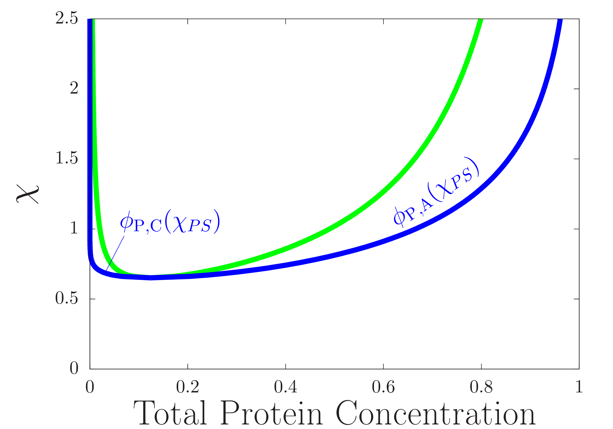
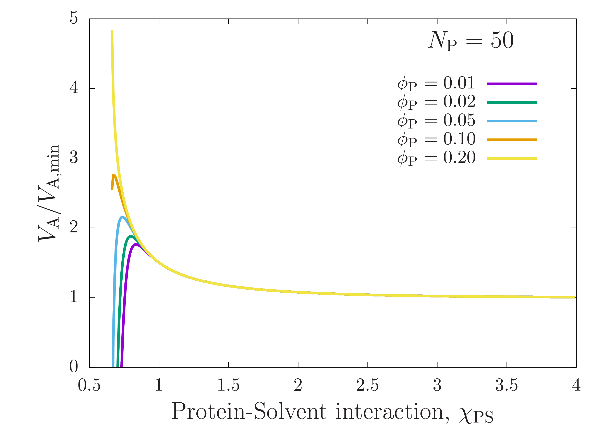
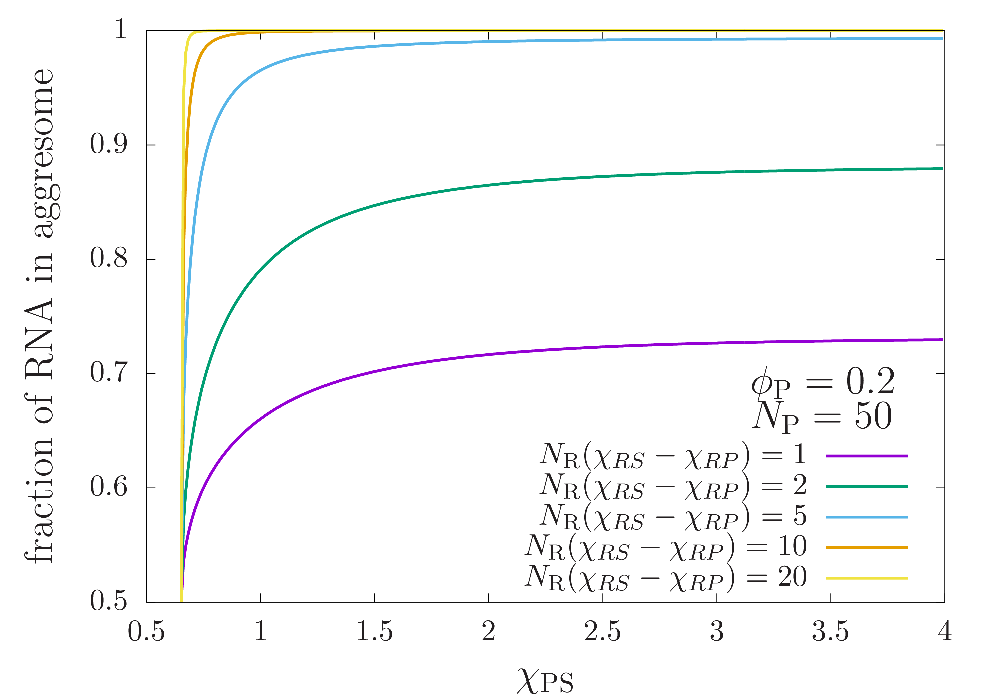
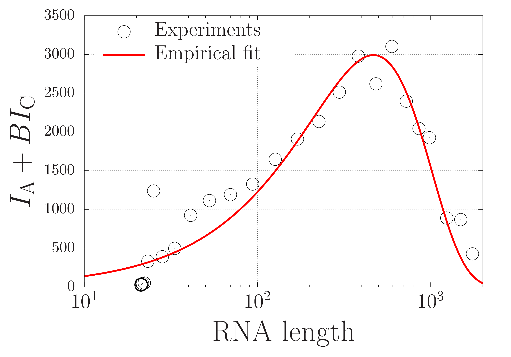
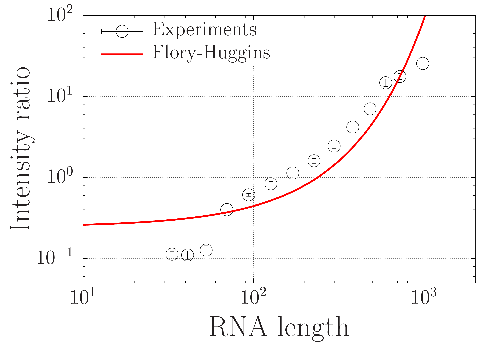
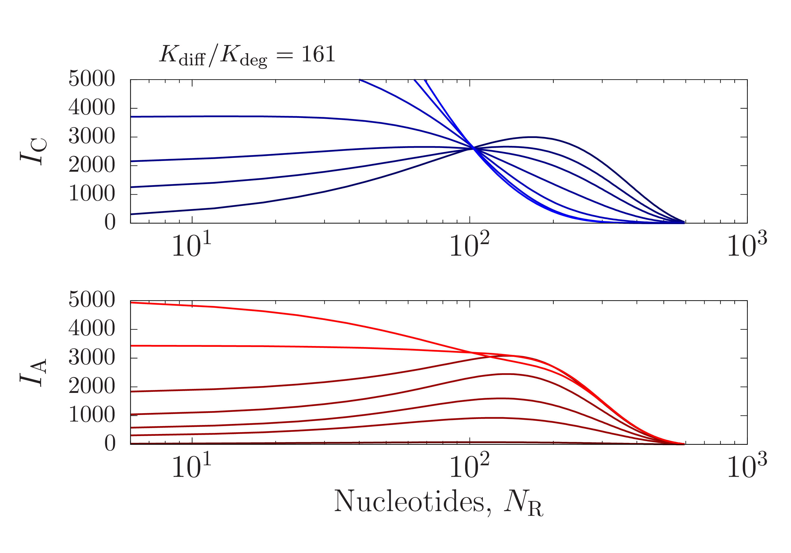
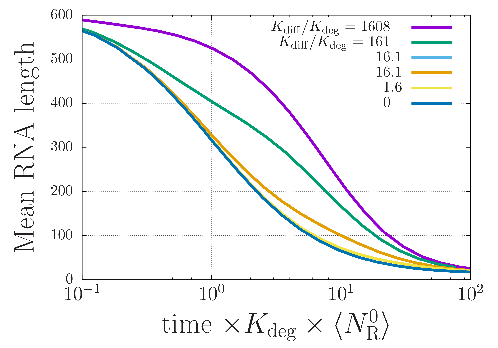

# Continuum Theory

## Thermodynamics

### Flory-Huggins Theory

The library in Thermodynamics/FloryHuggins/C includes functions written in C to calculate Flory-Huggins free energies and generate binary phase diagrams.

The phase diagram was calculated using Demo\_BinaryFH.sh, and the raw data was stored in PhaseDiagram_50.0.out. The phase diagram above was generated in eps format using gnuplot with the script mkfig\_PhaseDiagramB.sh. The png version was generated using eps2png.sh. 

Using the same data in PhaseDiagram_50.0.out and the eps2png.sh script, one can generate information about droplet compaction using mkfig\_DropletCompaction.sh:

and about RNA partitioning from the dilute phase to the droplets using  mkfig\_RNA\_partitioning.sh:

### ScreenTape Analysis

In the ScreenTape\_analysis directory, the Flory-Huggins model for RNA partitioning is compared to measured ScreenTape data. See ReadMe.txt in that directory for details.

## Dynamics

In the Dynamics directory the time-dependent RNA length distribution inside the droplets is calculated. See ReadMe.txt in that directory for details.

